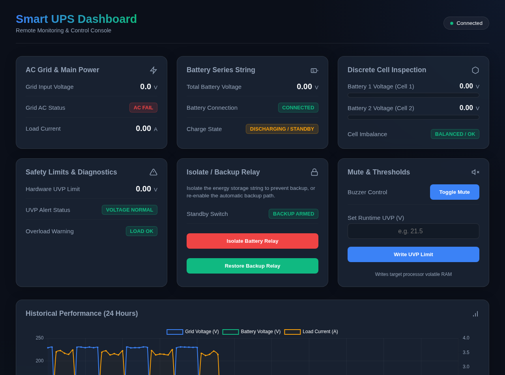

# Smart UPS Controller Platform

An advanced, open-source telemetry and controller platform designed for the **W5500-EVB-Pico** microcontroller, integrated with the **MEAN WELL LAD-600BU** power supply and a 24V nominal Lead-Acid (SLA) battery backup string.

The platform provides automatic network discovery, real-time telemetry monitoring, local database history tracking, and native MQTT publishing.



---

## Features

* **MicroPython Firmware Core:** Designed for the dual-core RP2040 on the W5500-EVB-Pico.
* **Auto-Discovery Network Protocol:** The board broadcasts lightweight UDP beacons; the Docker dashboard listens and pairs automatically without manual IP configuration.
* **Graceful Offline Tolerance:** Smoothly handles hardware UART connection timeouts if the power supply is disconnected.
* **Historical Database Logging:** Built-in SQLite database stores 24 hours of grid/battery voltage and load current graphs.
* **Asynchronous Telemetry Loop:** Built entirely using MicroPython's cooperative `uasyncio` framework.
* **MQTT Telemetry Publisher:** Publishes real-time JSON payloads natively over TCP to any standard MQTT broker (e.g. Home Assistant / Mosquitto).
* **Remote Control Actions:** Supports battery string isolation/connection, alarm buzzer muting, and under-voltage protection (UVP) threshold adjustment.

---

## Hardware Interconnect Mapping

### 1. W5500 Onboard Ethernet SPI0 Link
The W5500 Ethernet MAC/PHY is hardwired internally on the EVB-Pico PCB to the RP2040 SPI0 block:
* **MISO:** `GP16`
* **MOSI:** `GP19`
* **SCLK:** `GP18`
* **CS:** `GP17`
* **Reset:** `GP20`

### 2. MEAN WELL LAD-600BU UART1 Link
Connect the Pico's UART1 pins to the CN2 connector block on the power supply:
* **Pico TX (Output):** `GP4` $\rightarrow$ Connects to **LAD CN2 Pin 13** (UART_RX)
* **Pico RX (Input):** `GP5` $\rightarrow$ Connects to **LAD CN2 Pin 14** (UART_TX)
* **Logic Ground:** `GP3` (or any GND pin) $\rightarrow$ Connects to **LAD CN2 Pin 15** (GND)

### 3. Battery Cell Telemetry Center Tap
* **LAD CN2 Pin 9 (BAT1):** Must be bridged directly to the center tap link wire (bridging Battery 1 positive to Battery 2 negative). This is critical for parsing discrete cell metrics.

> [!CAUTION]
> **Mandatory Safety Requirement:** Always install a physical, inline safety fuse (20A–30A) directly on the high-current `BAT+` terminal wire. Software commands are not a substitute for physical fuses in short-circuit conditions.

---

## Quick Start

### 1. Preparing the MicroPython Board
1. Download the W5500-EVB-Pico MicroPython UF2: [MicroPython W5500 Firmware](https://micropython.org/download/W5500_EVB_PICO/).
2. Hold down the **BOOTSEL** button on your Pico, plug in the USB cable to your PC, and release the button.
3. Drag and drop the `.uf2` file onto the mounted **`RPI-RP2`** drive.

### 2. Flashing the Application Code
Ensure `uv` is installed, then run the deployment script to synchronize all production files:
```bash
uv run python deploy.py
```
*(On Linux hosts, if permissions are denied, run `sudo chmod 666 /dev/ttyACM0` first to authorize USB port access).*

### 3. Deploying the Dashboard Console
Rebuild and launch the dashboard console. You can deploy it using Docker Compose or standalone Docker CLI:

#### Option A: Deploy via Docker Compose (Recommended)
Simply build and run using docker-compose:
```bash
docker compose up -d --build
```

#### Option B: Deploy via Docker CLI
Rebuild and launch the container manually. Ensure you map port `5555/udp` to enable the auto-discovery mechanism:
```bash
docker build -t smart_ups_dashboard dashboard/
docker run -d \
  -p 8080:8080 \
  -p 5555:5555/udp \
  -v smart_ups_data:/data \
  --name ups-dashboard \
  smart_ups_dashboard
```

Open **[http://localhost:8080](http://localhost:8080)** in your browser. The dashboard will automatically transition from `Auto-Discovering...` to `Connected` the moment the Pico sends its first network broadcast.

---

## Development and Test Suite

The project includes unit tests for verifying checksum calculations (CRC-8), packet parsing, and register scaling values:
* **Running Unit Tests:**
  ```bash
  uv run python -m unittest tests.test_controller
  ```
* **Running the Simulation Server:**
  If you want to run the dashboard without physical hardware connected, spin up the local mock server:
  ```bash
  uv run python tests/mock_device_server.py 8000
  ```

---

## API Documentation

The Pico web daemon exposes a simple JSON REST API on port `80`:
* **`GET /api/status`**: Returns the complete parsed status register payload.
* **`GET /api/control?action=isolate`**: Disconnects the battery string relay.
* **`GET /api/control?action=connect`**: Reconnects the battery string relay.
* **`GET /api/control?action=mute`**: Mutes the onboard warning buzzer.
* **`GET /api/control?action=unmute`**: Unmutes the onboard warning buzzer.
* **`GET /api/control?action=uvp&voltage=21.5`**: Adjusts the under-voltage protection limit (18.0V - 28.0V).

*Note: All control actions target volatile registers inside the power supply controller RAM and will revert to factory defaults upon power-cycling the MEAN WELL hardware.*

---

## MQTT Telemetry Publishing

The MicroPython core includes a background async loop that periodically publishes real-time telemetry to an MQTT broker:

* **Default Status Topic:** `smart_ups/status`
* **Publishing Interval:** Configurable (default is every `10` seconds).
* **Payload Format:** A minified JSON object containing all active telemetry registers (identical to the REST API payload minus the local `last_update` timestamp). Example:
  ```json
  {
    "ac_ok": true,
    "battery_voltage": 27.60,
    "cell1_voltage": 13.80,
    "cell2_voltage": 13.80,
    "grid_voltage": 230.1,
    "load_current": 1.45,
    "lad_power_supply": true,
    "bat_chgfull": true,
    "bat_chging": false,
    "bat_uvp": false
  }
  ```

To customize your MQTT parameters, edit **[src/config.py](file:///home/josef/dev/smart_ups/src/config.py#L28-L35)**:
```python
# 5. MQTT Configuration
MQTT_BROKER = "192.168.1.50"       # IP Address of Mosquitto / Home Assistant Broker
MQTT_PORT = 1883                  # MQTT Port
MQTT_CLIENT_ID = "smart_ups_pico" # Client identifier
MQTT_TOPIC_PREFIX = "smart_ups"   # Topic namespace prefix
MQTT_USER = None                  # Username (None or String)
MQTT_PASSWORD = None              # Password (None or String)
MQTT_PUBLISH_INTERVAL = 10        # Interval in seconds
```

---

## License

This project is licensed under the MIT License - see the [LICENSE](LICENSE) file for details.
